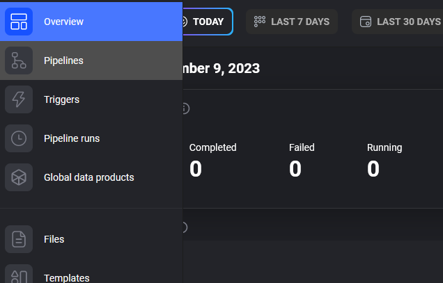
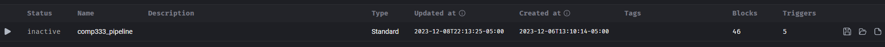
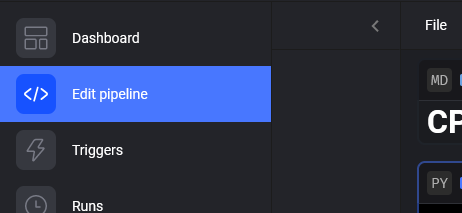
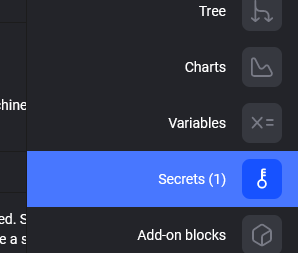
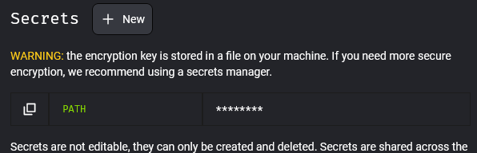
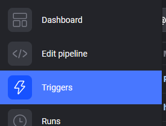
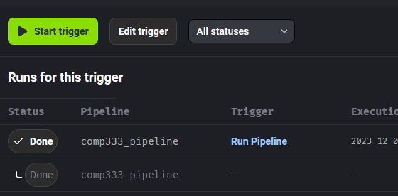
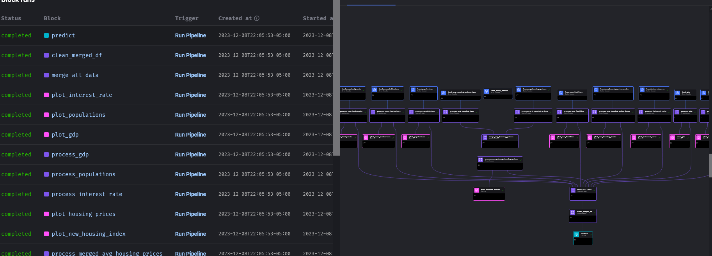

# COMP333Project

## Setup

1. Download the `keen-diode-...json` file from Discord and save it somewhere on your system. You will need it.
2. Create virtual environment for the project
3. Activate it
4. Install all dependencies in `requirements.txt`
5. Navigate to the root of this project
6. From the terminal, run `$ mage start`. Mage should now open on your browser.
7. On the left had side, click on Pipelines:
   
8. Click on the pipeline `comp333_pipeline`:
   
9. From the left hand side, click: "Edit Pipeline":
   
   
10. On the right hand side, navigate to the "Secrets" section:
    
    

11. Create a new secret using the "+ New" button. Call it `PATH`. Set its value to the absolute path on your
    system where `keen-diode-...json` is stored.
    

    Remember to hit "Enter" when done to save it.

Once the secret has been created, click the play button on a block to run it.

To run all blocks in Pipeline, go the "Triggers" pane from the left hand side.

If there does not already exist a trigger, create a new Trigger of 'Schedule' type,
scheduled for now and running 'once'.

Once running, can view progress by clicking on the trigger.

To re-run the trigger (especially useful for triggers that run 'now' and 'once'), click the triggers name
and click "Start trigger":

You can click on the 'Block runs' number to see a log of the status of each block in the pipeline and a tree view
of the pipeline, both of which auto-update as the pipeline runs:

**Note:** The `COMP333_Project_Data` folder on GitHub will be deprecated soon. We have it on GCP.
Please try to get Mage working on your system. This not only will confirm if you can get Mage working,
but also that you can interact with GCP properly via Mage.
