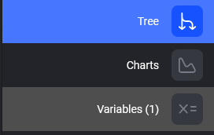
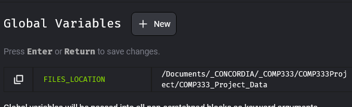

# COMP333Project

## Setup

1. Create virtual environment for the project
2. Activate it
3. Install all dependencies in `requirements.txt`
4. Navigate to the root of this project
5. From the terminal, run `$ mage start`. Mage should now open on your browser, 
where you can see the pipeline and all of its blocks.

6. On the right hand side, navigate to the "Variables" section:
    
7. Create a new global variable by clicking the "+ New" button.
The variable should be called `FILES_LOCATION` and be set to the location of `COMP333_Project_Data` on your computer:

Remember to hit "Enter" when done to save it.

Click the play button on a block to run it.

More documentation coming soon

